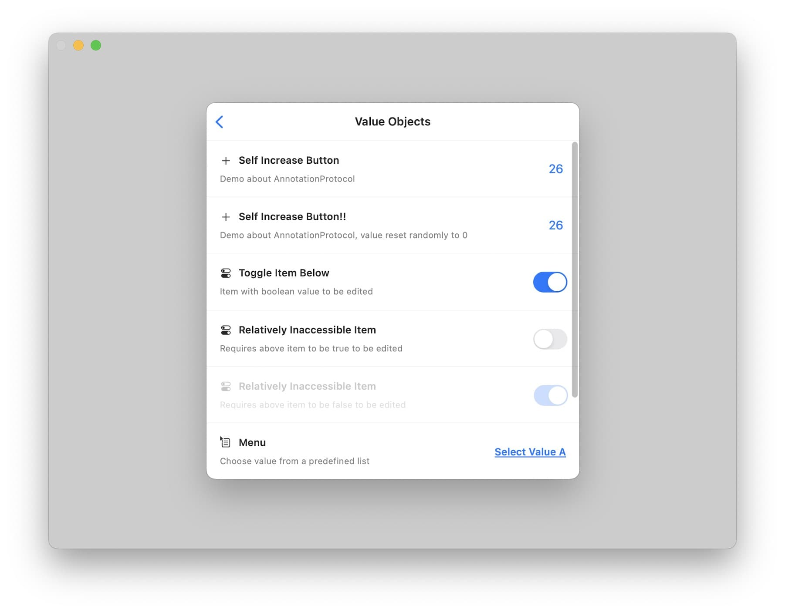

# ConfigurableKit

The simple but yet powerful way to build settings page.



## Features

We have a fully working demo to show how to use this library. You can find it in the Example folder. Just click and run.

- [x] Simple setup: define what you want and we handle the rest.
- [x] Ultra fast written in Swift and UIKit. (No SwiftUI)
- [x] Rich value type support, including Codable.
- [x] Sync your settings with UserDefaults.
- [x] Support for customizing the storage engine other than UserDefaults.
- [x] Support for nested values and controllers.
- [x] Support for disabling setting element based on condition.
- [x] Battle-tested in production: [TrollRecorder](https://github.com/Lessica/TrollRecorder).

## Installation

### Swift Package Manager

```swift
dependencies: [
    .package(url: "https://github.com/Lakr233/ConfigurableKit.git", from: "1.1.0")
]
```

## Usage

### import

```swift
import ConfigurableKit
```

After import the module, you can start using `ConfigurableObject` to define your settings.

Have a look at Example project for more details.

### Choose Storage

By default, we store settings in `UserDefaults`. You can change the storage engine by conforming to `KeyValueStorage`. Switch the storage engine by setting `ConfigurableKit.storage`.

**Make sure you set it before any other operation, including creating settings.**

```swift
// at main.swift, at very beginning
ConfigurableKit.storage = YourEngine()

_ = UIApplicationMain(
    CommandLine.argc,
    CommandLine.unsafeArgv,
    nil,
    NSStringFromClass(AppDelegate.self)
)
```

We use `AnyCodable` to store values, so you can store any type that conforms to `Codable`.

### Define Settings

You use `ConfigurableObject` to define your settings. Initializer already explain itself.

- `icon` is most likely SF Symbol name, if not available, it will be treated as a image name.
- `title` is the title of this setting.
- `description` is the description of this setting, explain what it does.

Then you can either use `ConfigurableObject.Annotation` to quickly define a setting, or use `ConfigurableObject.AnnotationProtocol` to define your own.

A toggle is demonstrated here.

```swift
ConfigurableObject(
    icon: "switch.2",
    title: "Toggle Item Below",
    explain: "Item with boolean value to be edited",
    key: "wiki.qaq.test.boolean",
    defaultValue: true,
    annotation: .boolean
),
```

After setup `ConfigurableObject`, you can use `whenValueChange` to observe value change. Return a new value inside the block if you want to change the value.

```swift
ConfigurableObject(
    icon: "plus",
    title: "Self Increase Button",
    explain: "Demo about AnnotationProtocol",
    key: "wiki.qaq.demo.self.increase",
    defaultValue: 233,
    annotation: SelfIncreaseNumberAnnotation()
)
.whenValueChange(type: Int.self) { print("Value Changed to \($0 ?? -1)") },
```

### Define New Setting

For more complex settings, you can use `ConfigurableObject.AnnotationProtocol` to define your own. `AnnotationProtocol` generates the view required for display. To have correct behavior, you should always use `object.__value` for reading and writing value.

```swift
class SelfIncreaseNumberAnnotation: ConfigurableObject.AnnotationProtocol {
    func createView(fromObject object: ConfigurableObject) -> ConfigurableView {
        SelfIncreaseNumberConfigurableView(storage: object.__value)
    }
}
```

After define the annotation object, make a view confirm to `ConfigurableView`. For most value related view, you can use `ConfigurableValueView`.

```swift
class SelfIncreaseNumberConfigurableView: ConfigurableValueView {
    var button: UIButton { contentView as! UIButton }

    var intValue: Int {
        get { value.value as? Int ?? 0 }
        set { value = .init(newValue) }
    }

    override init(storage: CodableStorage) {
        super.init(storage: storage)

        button.addTarget(self, action: #selector(tapped), for: .touchUpInside)
    }

    override class func createContentView() -> UIView {
        let button = UIButton()
        button.setTitleColor(.systemBlue, for: .normal)
        return button
    }

    override func updateValue(_ value: AnyCodable) {
        super.updateValue(value)
        button.setTitle("\(intValue)", for: .normal)
    }

    @objc func tapped() {
        intValue += 1
    }
}
```

### Present Setting Controller

We have two view controller for easy use. Both of them accepting a `ConfigurableManifest`. Manifest is just a list of `ConfigurableObject`, with a title and a footer.

- ConfigurableSheetController

Used to present settings in a sheet style. Inherit from UINavigationController.

- ConfigurableViewController

If you already have a navigation controller, you can use this to push settings.

```swift
lazy var settingController = ConfigurableSheetController(manifest: .init(
    title: "Settings",
    list: configurableValues,
    footer: "Made with Love by Own Goal Studio"
))
```

## License

[MIT License](./LICENSE)

## Credits

- https://github.com/Flight-School/AnyCodable

---

Copyright © 2024 Lakr Aream & Own Goal Studio. All Rights Reserved.
